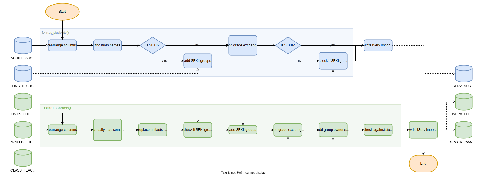

# iserv-import
Tool to convert SchILD, Untis and GomSTH data to import files for iServ. This script is highly adjusted to the use cases of one school, so it's very likely that it's not directly usable for others. However, feel free to use my (at some points not very elegant :)) code as a basis for your import tool.

# documentation

## required modules
- pandas
- os
- csv
- re
Normally, most of these modules are already installed.

## execution
Just execute the script with python3. It is tested with Python 3.10.1

```
python3 iserv-import.py
```
or 
```
python iserv-import.py
```

## encoding
The GOMSTH file and maybe also other files are usually in `Western (Windows 1252)` encoding. The script needs them to be in `utf-8`.

## required input files
The following files can be edited at the top of the script
- SCHILD_SUS_FILE: `data-src/sus2.csv`
- GOMSTH_SUS_FILE: `data-src/GOMSTH.csv`
- SCHILD_LUL_FILE: `data-src/LuL5.csv`
- UNTIS_LUL_FILE: `data-src/GPU002.TXT`
- CLASS_TEACHERS_FILE: `data-src/GPU003.TXT`
## generated output files
- ISERV_SUS_FILE: `data-out/Iserv SuS.csv`

    file to import in iServ containing all students
- ISERV_LUL_FILE: `data-out/Iserv LuL.csv`

    file to import in iServ containing all teachers
- GROUP_OWNERS_FILE: `data-out/group_owners.csv`

    file containing one entry per group with the group name and owner

## program flow


## details - students
### rearrange columns
Rearrange columns of SchILD_SUS_FILE to `Vorname, Nachname, Klasse, Import-ID, Gruppen`.

### find main names
Find the name in SchILD written in uppercase and select it as main name. If multiple names are written in upper case all these names are concatenated. If no names are written in uppercase all names are concatenated.

### add SEKII groups
Add all groups mentioned in GOMSTH_SUS_FILE and format group name correctly (see group name patterns).

### add grade exchange groups 
Add "Austausch xy" groups for the grades.

### check SEKI groups
Check whether all SEKI groups also appear in UNTIS. If not, they are deleted. These deletions are also logged at the end because they might just have something to do with different namings.

### debugging afterwards
There are several things which have to be controlled after running the script as it cannot resolve some manual mappings:
- All deleted groups are rightly deleted and don't correspond to different naming of courses. If not, they have to be mapped to UNTIS names or the search subject has to be adjusted. These things can be adjusted with the manual mapping at the top of the file.
- There should be no errors, otherwise there might be something wrong and the easiest way to fix this is changing it in the input or output file.
- Warnings can normally be ignored but still you should read them to find possible mistakes. They usually report unual but not impossible szenarios.

<b>Hint:</b> if you want more detailed errors and warnings, set the constant `VERBOSE` at the top of the file to true. If you also set the constant `SUPPRESS_DUPLICATES` to false you also see warnings for duplicate courses.

## details - teachers

## group name patterns
### SEKI courses
### SEKII courses
The course name is computed like this:
```
course          = subject_prefix? subject "_" grade "_" type "_" teacher
subject_prefix  = P | V
type            = LK[A-Z] | LK[1-9] | GK[1-9]
subject         = [A-Z]{1,2} | S0 | S8 | SP[1-3]
grade           = 10 | 11 | 12 | 13
teacher         = [A-Z]{3}
number          = [A-Z] | [1-9]
```
Notice that the syntax for the subject is not that strict and may also contain longer names. But they are always uppercase.

Sometimes LKs are counted from a to z, sometimes from 1 to 9.

P stands for project courses, Z for extra courses. 

The extra courses are mapped like this: `GE -> GN`, `SW -> SN`. The PE (`SP`) courses are mapped to `SP` plus the profile number. The vocal/instrumental course is mapped from `iv` to `VP-IP`